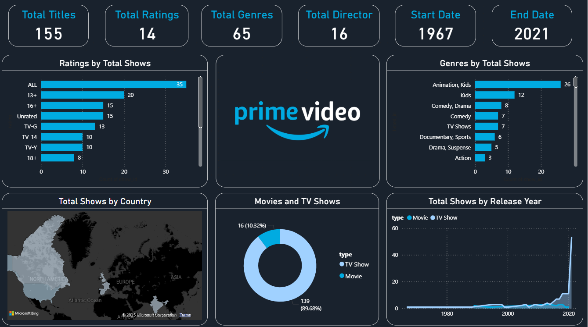

# 🎬 Amazon Prime Movies & TV Shows Dashboard

This project provides a visual analysis of Amazon Prime’s Movies and TV Shows dataset. The dashboard offers key insights into the distribution of content by rating, genre, country, and release year through interactive visualizations.

---

## 📌 Project Overview

The goal of this project is to explore and analyze Amazon Prime’s streaming content by building a clear and insightful dashboard using Power BI.

---

## 🔍 Key Insights

- **Total Titles:** 155  
- **Time Span:** 1967 to 2021  
- **Content Type:**
  - 🎥 89.68% Movies  
  - 📺 10.32% TV Shows  
- **Top Genres:** Animation/Kids, Comedy/Drama, Documentaries  
- **Content Ratings:** Most titles rated “ALL”, followed by “13+”, “16+”, and others  
- **Top Release Years:** Noticeable spike in content after 2015  
- **Global Reach:** Content originates from multiple countries (visualized on a world map)

---

## 🛠️ Tools & Technologies

- **Power BI** for interactive dashboard creation  
- **Power Query** for data cleaning and transformation  
- Visual elements: bar charts, pie charts, map visuals, line chart

---

## 📷 Dashboard Preview



---

## 🚀 Usage

Download and open the Power BI file:

```bash
amazon-prime-dashboard.pbix
